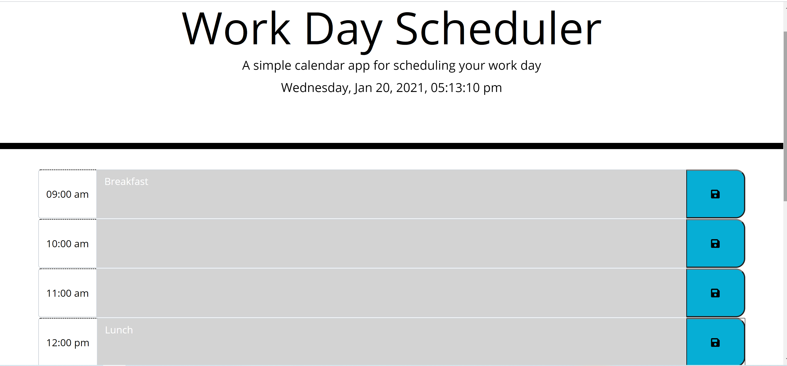

# Work-Day-Scheduler

In this assignment  I used index.html,script.js, style.css. It shows current time  and  schedul time table daily events and also can save daily events.

<!--  -->

URL:https://negasimichael.github.io/Work-Day-Scheduler/